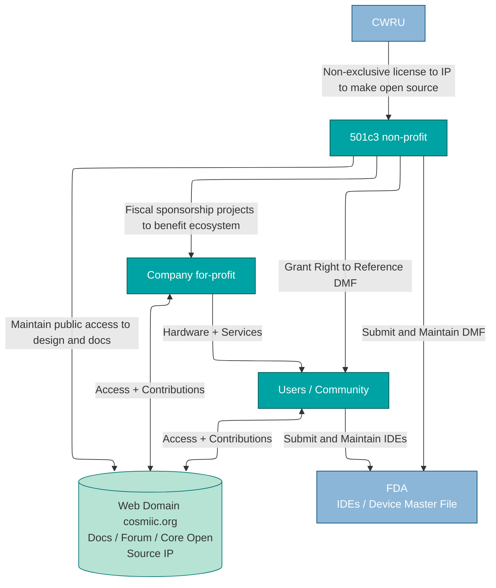

import Mermaid from '@theme/Mermaid';

# Open Source Ecosystem Governance

Outlining the responsibilities of the maintainers and typical interactions for those using COSMIIC resources

---

## Overview
The COSMIIC open source ecosystem is intended to become a community-driven effort. The goal of the governance structure is to define responsibilities and relationships in a way that ensures the ecosystem remains transparent and inclusive while also protecting the core intellectual property for all users.
The following is a preliminary envisioning of a pragmatic plan for continuing the COSMIIC ecosystem after the current grant funding. 

It is recognized the COSMIIC open source ecosystem is growing and evolving and may eventually merit changes to this structure. As needs change, we will seek out how governance responsibilities may shift in response. Changes in governance structure will be communicated through all means possible, including this documentation site, social media feeds, newsletters, and the community forum.

---

## Diagram

This simplified diagram was created using the [Mermaid](https://mermaid.js.org/#/) diagramming and charting tool to visualize the responsibilities and interactions described below. The source code for the diagram is embedded in the Markdown file responsible for generating this page found [here](https://github.com/COSMIIC-Inc/Documentation-Source/tree/main/docs)

---

## Interactions

- Open Source Design / Web Domain (cosmiic.org)
  - All entities revolve around, contribute to, and must maintain access to this shared knowledge base.
  - All products and information ultimately tie back to it
  - All administration for the design and documentation is conducted through the cosmiic.org web domain
- Non-Profit ↔ CWRU
  - Non-Profit maintains non-exclusive license with Case Western Reserve University, granting right to publish core IP and materials to open source
- Non-profit ↔ FDA
  - Non-profit submits a Device Master File to FDA with corresponding open source details on cosmiic.org
- Users ↔ Non-Profit
  - Users access the open-source design (hosted/stewarded by the non-profit) through cosmiic.org and its subdomains
  - Users may also contribute back improvements, documentation, or feedback.
  - Users make requests to Non-Profit for right to reference the Device Master File held at FDA
- Users ↔ For-Profit
  - Users purchase hardware and services from For-Profit companies that implement the design.
  - Implantable hardware and externals + sterilization must be in line with information held in Device Master File
- Non-Profit ↔ For-Profit
  - Fiscal sponsorship: Non-Profit supports projects at For-Profits, future community leaders, or other organizations to benefit the open source effort / community
  - For-Profit leads correspondance with Users and Non-Profit to communicate design/manufacturing/packaging changes that have regulatory implications.
- Users ↔ Users
  - Users collaborate and share experiences through forum on cosmiic.org
- Users ↔ FDA
  - Users with hardware, tech literacy, and right of reference will submit their own IDE as Manufacturer of Record

---

## Entities

- **Community**
  - Users, Contributors, Collaborators
  - Individuals or organizations using the open source design and documentation
  - May be startups, academic researchers, engineers, physicians, students, etc.
- **Non-profit** - **[Give A Hand.tech](https://give-a-hand.tech)**
  - Maintainer
  - 501c3 non-profit organization formed to solve the problem of device abandonment in the neurotech field
  - Maintains public access to the open source design and documentation
  - Give A Hand Board of Directors: Nathan Makowski, Brian Smith, Anne Bryden (Disclosure: investigators related to development and human trials of COSMIIC devices)
- **For-Profit** - **[Open NeuroTech LLC](https://openneuro.tech)** and possible others
  - Servicers
  - For-profit company formed to provide hardware and services to users of the open source design
  - May be other companies that choose to provide hardware and services
  - Open NeuroTech Personnel: Chris Rexroth and Dan Romano (Disclosure: engineers on COSMIIC project grant)