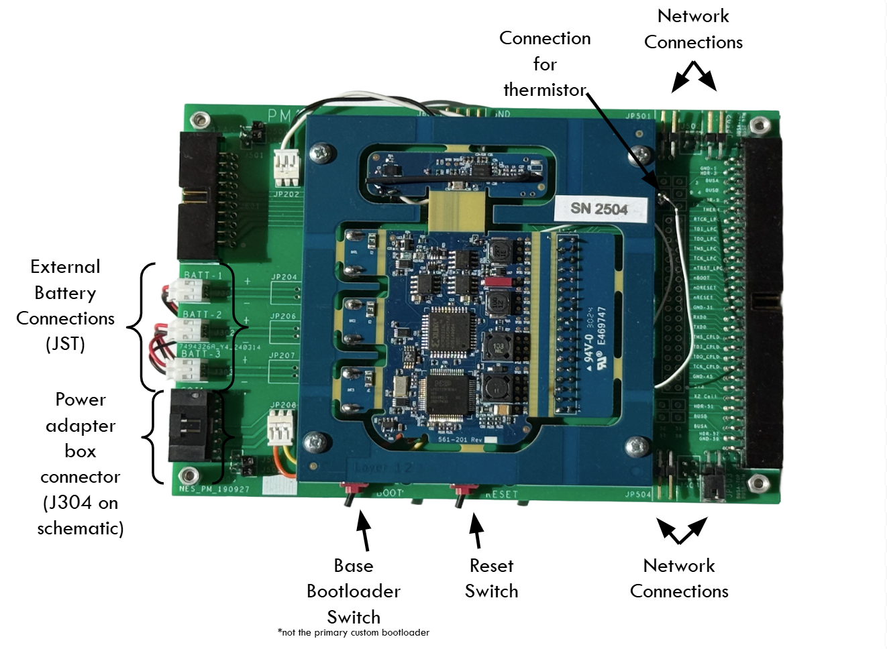

# Setting up the Hardware

This guide introduces the setup of the COSMIIC Power Module (PM) development board, explaining its functionality and setup to connect additional modules as well as the Wireless Link, the device responsible for radio communication to the PM.

---

### Required

- PM Development Board
- Optional: Any additional modules (PG4 and/or BP2 Development Boards)
- Wireless Link board + USB-C cable

---

## Hardware Setup Overview

The PM Development Board consists of a PM module circuit board and an accompanying frame board for:
  - Power input (batteries or power supply) 
  - Network connection
  - Output monitoring
  - Programming

### Connecting the Hardware / Stacking Modules

Modules (PG4 or BP2) can be stacked on top of the PM or connected via cable pairs for distributed setups.

- When stacking modules, ensure that the modules have the correct orientation, with the network connections facing towards the right side of the board. The Power Module should be on the bottom of the stack, with additional modules placed on top.

- The network connections on the frame board require jumpers to connect stacked boards to each other. The top two pins on the network connector are “BUSA”, and the bottom two are “BUSB”. BUSA pins should be connected to BUSA, and BUSB pins should be connected to BUSB. Example stack configurations are shown below.

- As a rule of thumb, modules on the stack can have the left set of jumpers connected, with the right set used for connecting external modules not on the stack.

### Connecting power

The input voltage range is approximately 6-20 volts with 12-16 volts an optimal input level. Voltage below approximately 9V will not charge the batteries, if connected. Voltages above 30V will be clamped at 30V by the series connected 15V Zener diodes. 

#### Using power supply

The PM can be turned on and powered by a lab power supply. The schematic to the 6-pin mate to J304 on the frame board is shown below.

Using J2 and J3 as inputs provides a non-polarized input option with the caveat that there is no reference to the PM ground. Using J4 and J5 as inputs provides a polarized input with J5 as a PM ground reference. We recommend using extensions to attach pins 5 and 6 to allow use of J4 and J5 as power inputs, as shown in the image below. 

:::warning CAUTION

A reversed polarity connection will damage the PM.

:::

#### If adding batteries

The PM can also be operated without a power supply by connecting batteries with a JST connector. We recommend a 3.7V, 450mAh, 502535 Li-Polymer rechargeable battery pack. There are three spots on the PM dev board for these battery packs mirroring the battery cells in the implantable PM device and can be taped to the bottom of the PM dev board.

If batteries are connected to the PM, the PM will continue to run when the external power is removed. Cycle the reset switch on the PM to shut the system down or issue a software command to shut the system down. 

### Turning power on

1. Use a desktop voltage supply or a custom adapter box to connect your PM to power.
2. Ensure supply is **OFF** before connecting to PM.
3. Turn on supply and wait ~15 seconds for bootloader period to complete. After this period has elapsed, the
power module will fully turn on.
4. Make sure the PM dev board's switches are pushed away from **BOOT** and **RESET**.
5. Ensure network mode is **OFF** (or entire stack is **OFF**) before connecting additional modules to PM.

After the PM has passed through bootloader mode, a red LED will start blinking on the top surface of the module circuit board. For any modules connected in the stack, they will only be powered and communicated once the network is turned **ON** through the API and jumpers are connected.    

:::tip Summary of Good Practices

- Power Module at the bottom of stack
- Orientation: network connections on the right
- Jumpers present on all stacked modules intended to be on network: 
  - Top 2 pins = `BUSA`
  - Bottom 2 pins = `BUSB`
- Left jumper set: stack  
- Right jumper set: external modules

:::

### Wireless Interface - Wireless Link Hardware

The Wireless Link is the bridge that connects desktop computers, mobile devices, and sensors to the implanted COSMIIC system, facilitating wireless communication for programming, the integration of smartphone app interactions, and a path towards closed-loop stimulation based on physiological signals captured external to the COSMIIC System. The Wireless Link is a type of Access Point, a term which appears throughout the software documentation.

In the case of the development kit, the Wireless Link is the conduit by which MATLAB on a computer can control the COSMIIC System. The radio on the Wireless Link connects to the radio on the power module. All wireless commands are taken in and confirmed by the PM and then the PM controls the rest of the system.

All that is needed to use the Wireless Link with the development kit is a USB-C data/power cable compatible with your desktop computer's ports. The Wireless Link shows up as a USB device and is connected through a MATLAB command to start any session using the COSMIIC System. This is covered later in this section in [**Controlling the System Software**](./Step3-Software.md).