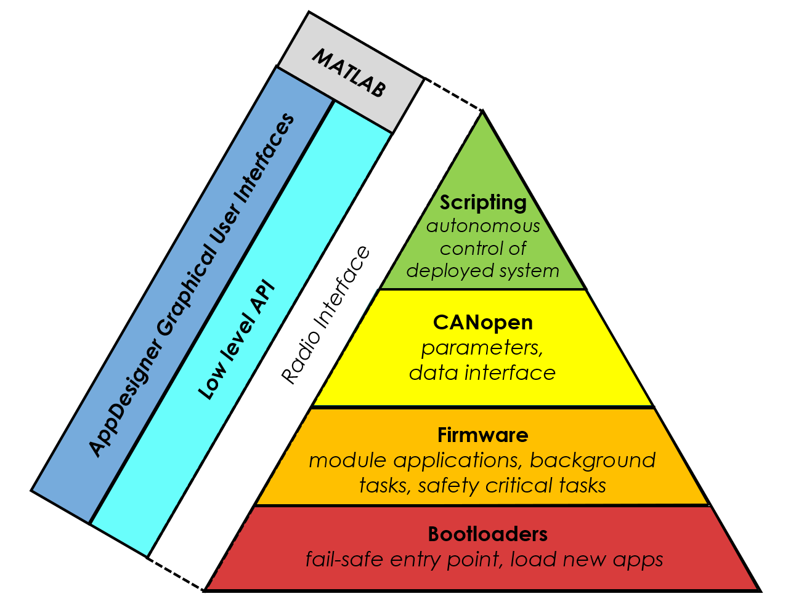

# Understanding the System Architecture

This guide introduces the COSMIIC System's network, API, and first steps to controlling your dev kit through MATLAB

---

## Software Overview

The COSMIIC System and its networked concept operate through multiple layers of embedded firmware and external software, bridged by wireless radio communication. 

### Module Firmware

- **Layer 1: Bootloaders**
  - Fail safe entry point for module
  - Allow firmware updates in situ
  - *PM bootloader:* Recover radio settings in the case that the wireless access point’s radio settings are cleared
  - *PG4/BP2 bootloader:* Allow node # of module to be changed, resets the Object Dictionary (both will be discussed below)
- **Layer 2: Firmware**
  - Module-specific applications: Run continously on modules following defined operations and interactions with the network and the external environment
  - *PM app:* handles wireless communication, facilitates network requests to modules, local processing.
  - *PG4 app:* controls circuitry for generating stimulation pulses, processes accelerometer, temperature data, and other diagnostics.
  - *BP2 app:* controls recording hardware, processes accelerometer, temperature data, and other diagnostics.
- **Layer 3: CANopen**
  - The network of the COSMIIC System uses the [**CANopen standard**](https://www.can-cia.org/can-knowledge/canopen) to enable the modular design.
  - CANopen is the set of specifications and protocols that allow modules to communicate when physically connected at the network ports.
  - See the [**Network Concepts**](#network-concepts) section below for more on the network.
- **Layer 4: Scripts**
  - Scripts are a constrained mechanism of customizing the operation of the implanted device for the individual user.
  - They are executed in the power module.
  - (Information on scripts will be included in future advanced documentation)

 ###  Wireless Interface
- **Layer 5: Radio Firmware and Software**
  - Set of defined functions and protocol that allows different software applications to control radio hardware and translate messages.

### External Control Software (MATLAB)
- **Layer 6: NNP API**
  - An API is implemented in MATLAB to communicate bi-directionally with the system through radio. Commands sent through the API will be received by the power module and used to control modules on the network.
  - This API can be used to build MATLAB scripts, App Designer applications, and fully deployed applications. (These will be described in future advanced documentation)
  - The [**NNP-API repository**](https://github.com/COSMIIC-Inc/NNP-API) is available on the COSMIIC GitHub.
  - NNP-API holds several fundamental commands for scripting (i.e. in NNPCORE and NNPHELPERS) and a subdirectory of designed apps with a GUI.
- **Layer 7: MATLAB Apps**
  - There are several user-ready GUIs made by the COSMIIC team which can be used for operating the device and testing out certain functionalities.
  - These can be found in the [**NNP-API repository**](https://github.com/COSMIIC-Inc/NNP-API) and some are listed on the [**Example Code**](./Example-Code.md) page

---

## Network Concepts

### Object Dictionary (OD)

The [**CANopen Object Dictionary**](https://www.can-cia.org/can-knowledge/canopen-internal-device-architecture) is a fundamental concept used in the COSMIIC System. The OD is essentially a pre-defined map of accessible data across modules (or "nodes" per CANopen) of the network. The defined structure implented for all COSMIIC components enables the replicable access of data and parameters from any node through the network. Each datum (or "object") within the OD is addressed using a 16-bit index and a 8-bit sub-index. It serves as an interface between the communication and the application on the modules.

Entries in the OD can have different formats or permissions. Entries can vary by data type (uint8, string, array of int16, etc) or by permissions (read+write, read only, or write only).

For example, here are some OD entries relevant to the PG4 module. These indices and their subindices point to memory locations at which specific data can be read or overwritten:

| Name             | Index   | Subindex | Description                                              | Permissions |
|------------------|---------|----------|----------------------------------------------------------|-------------|
| Accelerometers   | 0x2011  | 1        | Current accelerometer value                              | Read-only   |
| Diagnostic_VIN   | 0x3000  | 2        | Measured network voltage                                 | Read-only   |
| Channel_IPI      | 0x3210  | 9        | Inter-Phase Interval of stimulation waveforms            | Read/write  |

---

### Network Communication

There are several ways to interact with modules on the CANopen network: Service Data Objects and Process Data Objects transfer information across the network, and Network Management protocol is used to send commands to modules. The Synchronization Object is used to provide the consistent timebase for modules on the network to follow.

#### Service Data Object (SDO)

A request for information from one module to another. For example, when requesting data from a module’s OD via `nnp.read()` in MATLAB, the power module transmits an SDO on the network and then the target module responds with the requested data. This is the simplest method of requesting data, but requires two network messages to retrieve one piece of data. If there are multiple entries, from multiple modules that need to be requested, the network can quickly become congested with requests.

- Request-response method for reading/writing OD entries.
- Used in `nnp.read()` and `nnp.write()`
- Efficient for small or occasional data transfers.

#### Process Data Object (PDO)

The solution to the network congestion problem with SDOs can be solved with the use of PDOs. PDOs are an automatic, configurable way to transmit data across the network. In this technique, modules will monitor the network for a selected data broadcast from another module. For example, a module can be configured to broadcast accelerometer data to the power module with a Transmit PDO, and the broadcasted data is transferred to a specific location in the receiving module's OD by Receive PDO.

- Broadcast mechanism for transferring data.
- Module configured as either:
  - **Receive PDO (RPDO)**: Monitor and intake data
  - **Transmit PDO (TPDO)**: Stream out data

#### Synchronization Object (SYNC)

A SYNC message is cyclically transmitted on the network to serve as the reference time for all operations on the network. These SYNC messages can be used to synchronize anything, but are mostly used to synchronize the PDO transmissions or to synchronize actions. On the PG4, SYNC messages are responsible for triggering the scheduler which causes output of stimulation pulses (effectively setting the stimulation frequency).

- Timebase for all modules.
- Drives the scheduler that triggers stimulation pulses.

#### Network Management (NMT)

NMT protocols are used to monitor and initiate changes of device state, indicate errors, or reset devices. 

  - Change between operation modes, such as turning the network ON with `nnp.networkOn` or switching in and out of stimulation mode with `nnp.enterWaiting` and `nnp.enterTestStim`
  - Save changes to OD (advanced)
  - Load stimulation patterns (advanced)
  - Enable/disable functional groups (advanced)

:::warning NOTE
For the purposes of this Getting Started section, we will only be focusing on the use of SDOs to transfer information between modules on the network.
:::

*Now you're familiar with some of the COSMIIC System network terminology. Move on to the instructions for software control through MATLAB*