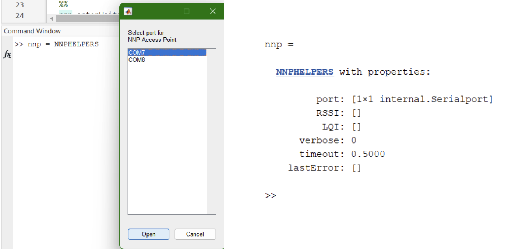
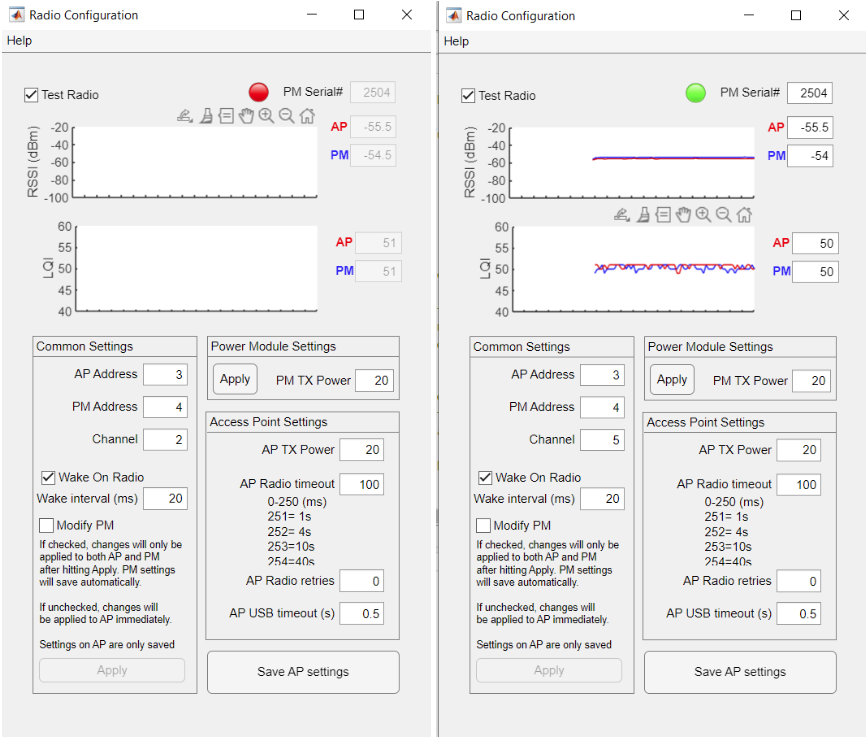
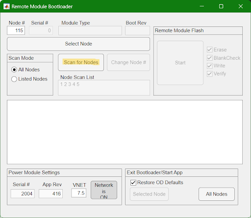
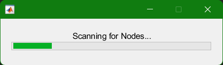
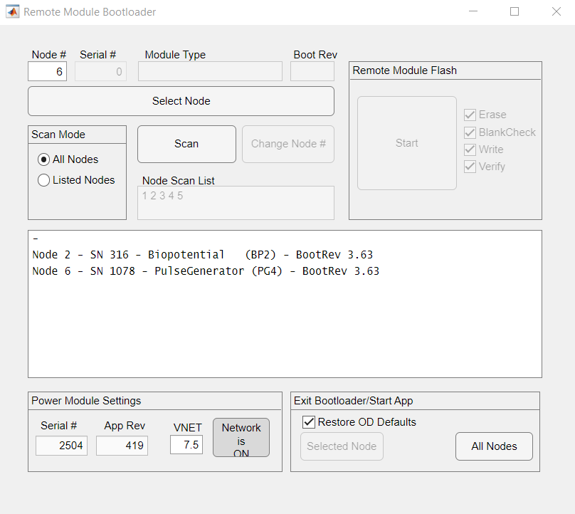

# Controlling the System

This guide introduces the use of the API to control the COSMIIC System through MATLAB

---

### Required

- PM Development Board
- Optional: Any additional modules (PG4 and/or BP2 Development Boards)
- Wireless Link board + USB-C cable
- MATLAB
- Local clone of the [**NNP-API**](https://github.com/COSMIIC-Inc/NNP-API) git repository

---

## Interfacing with MATLAB

1. Clone the [**NNP-API**](https://github.com/COSMIIC-Inc/NNP-API) repository from the COSMIIC GitHub page to your local device. Follow GitHub instructions for cloning [**here**](https://docs.github.com/en/repositories/creating-and-managing-repositories/cloning-a-repository).
2. Open the NNP-API folder in MATLAB. It will be at Documents/GitHub/NNP-API by default if you use GitHub Desktop to clone.
3. Connect your Wireless Link to your computer by USB-C cable
4. Turn on your PM and wait for the bootloader period to end

### Using NNPHELPERS

:::tip NNPHELPERS
In the NNP-API repository, there are two main files which contain the essential functions needed to control the COSMIIC System through the Wireless Link: 
- `NNPCORE.m` contains the basic functions for directing the CANopen network and interacting with data on the modules.
- `NNPHELPERS.m` simplifies the user experience by creating a layer of functions implementing NNPCORE for common practical use cases. 
  - NNPHELPERS opens a serial port to communicate with the Wireless Link
  - Use `doc NNPHELPERS` to see available commands

NNPHELPERS opens a serial port to communicate with the Wireless Link. A menu to select a USB device port will appear. Once connected, info is printed in the MATLAB console. 
:::

5. Create an instance of NNPHELPERS

```matlab
nnp = NNPHELPERS(); % Create API instance
```



The NNPHELPERS instance (this one named `nnp`) can be passed into different applications and functions to interact with the system.

---

:::info
The following sections are typically only needed in initial setup or when adding/removing/changing modules in the system. 
:::

### Radio Configuration

First, make sure the Power Module is talking to the Wireless Link.

6. Open the Radio Configuration app

```matlab
radioconfig(nnp) % Run the Radio Configuration application
```

7. Enter default radio settings
    - AP address: 3 (Access Point wiWireless Link is an Access Point)
    - PM address: 4 (PM will only respond to messages intended for address 4)
    - Channel: 5 (tuned radio frequency)

An example of a disconnected (incorrect channel) and connected Power Module are shown below. Ensure that the ‘Test Radio’ checkbox is selected.



8. If modifying the addresses and channel, document the change and new settings to avoid future issues with radio communication and troubleshooting

---

### Managing Modules Connected to PM

Now, discover and manage the other modules that may be connected to the PM through the network. 

:::tip NODE NUMBERS
In the CANopen framework, modules are assigned to a **node**. It is important to know the **node number** of each module in your system; this number is attached used to direct commands and read/write information from a specific module. Node numbers can be found and changed using the Remote Bootloader App.
:::

9. Open the Remote Module Bootloader app (remote modules are any type of module on the network besides the Power Module)

```matlab
rmbootloader(nnp) % Run the Remote Module Bootloader application
```



10. Select "Scan for Nodes" to probe the network for available nodes



Nodes connected to the network will populate the list with their assigned node number. If multiple nodes have the same node number, that response will also be displayed in the list. Clicking on a node in the list and hittiing the ‘Select Node’ button unlocks the option to change node numbers, upload new firmware to the device, and restore the object dictionary to default values.



11. Change node numbers if necessary
    - If two or more modules have the same node number, you need to change one or all to avoid network communication conflicts. "Select node" will select the first responding module to change.

12. Note assignments of node numbers to physical modules
    - Each module can be identified by its printed serial number. Note: The frame boards of development boards also have a serial number, the referenced serial number is the PG4 serial number, NOT the frame board number.

*You now have your MATLAB environment and your development kit configured. You can move onto your first stimulation pulses*