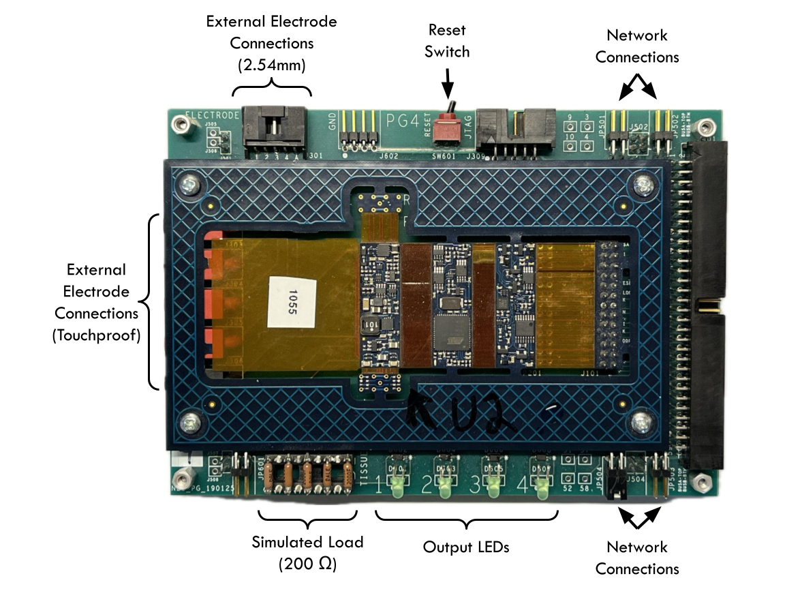
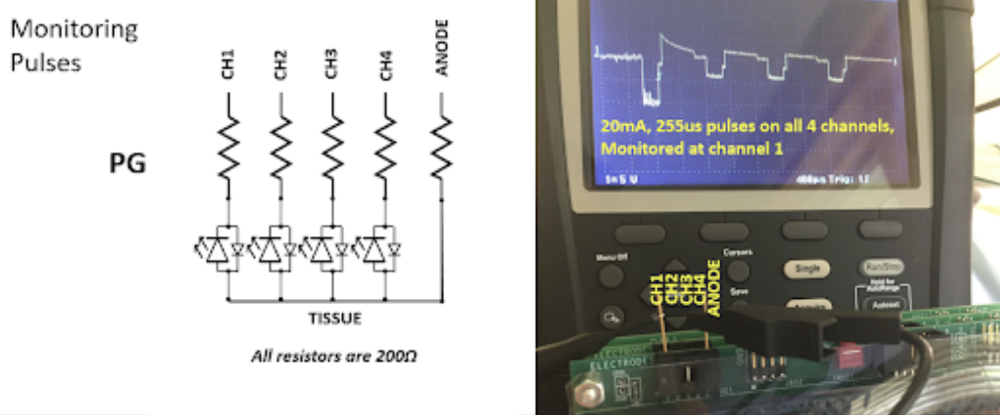
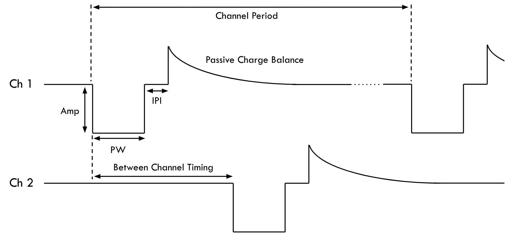
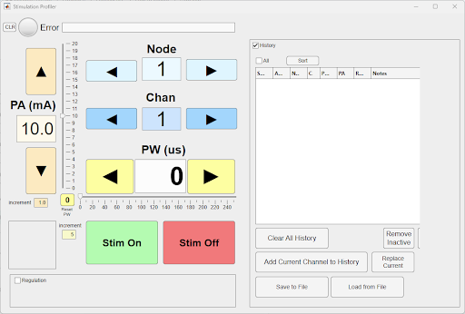

# Stimulation with the PG4

This guide introduces the COSMIIC 4-Channel Pulse Generator (PG4), explaining its functionality and setup to generate basic pulses.

---

### Required

- PM Development Board
- PG4 Development Board
- Optional: Any additional modules (PG4 and/or BP2 Development Boards) may be present while controlling one PG4 module
- Wireless Link board + USB-C cable
- MATLAB
- Local clone of the [**NNP-API**](https://github.com/COSMIIC-Inc/NNP-API) Github repository

---

## Hardware Overview

The PG4 Development Board consists of a PG4 module circuit board and an accompanying frame board for:
  - Network connection
  - Output monitoring
  - Accessory/electrode connection



### Connecting the Hardware / Stacking Modules

- Requires a PM  Development Board to provide power and communication
- Modules can be stacked or connected via twisted pair cables for distributed setups.
- Follow the directions on **[Setting up the System - Hardware](./Step1-Hardware.md)** for connecting modules to the PM

### Monitoring Stimulation Pulses

- Use oscilloscope on electrode outputs (touchproof or 2.54mm).
- Measure all channels relative to anode.



---

## Stimulation Pulse Parameters

The PG4 generates biphasic, passive charge balanced waveforms with adjustable pulse width, pulse amplitude, and stim frequency. Below is a timing diagram which shows the relationship of configurable stimulation parameters.



### Configurable Parameters

The following stimulation parameters are configurable in software:

| Parameter              | Description                        | Range                  |
|------------------------|------------------------------------|------------------------|
| Pulse Width (PW)       | Width in µs                        | 1–255 µs (1 us resolution) |
| Pulse Amplitude (PA)   | Amplitude in mA                    | 0–20 mA (0.1 mA resolution) |
| Inter-Phase Interval   | Time between phases                | 5–100 µs (1 us resolution, default 50) |
| Channel Period (SYNC)  | Time between pulses (same channel) | 10–65535 ms (1 us resolution, default 80)|
| Between Channel Timing | Time between channel pulses        | 1 ms default |

The operation of the network can be synced to a minimum cycle of 20ms. The Between Channel Timing adds 1 ms for each channel above channel 1 (e.g. channel 1 has a minimum SYNC period of 20 ms, channel 2 must be used with a SYNC greater than or equal to 21 ms... channel 4 must be used with a SYNC greater than or equal to 23 ms). To increase the frequency, certain details of the network operation must be altered to lessen the SYNC period or could be hard-coded directly into the PG4 firmware. PG4s have a hard-coded limit of 10 ms (10 Hz) which can theoretically be changed.

### Pulse Control Methods

There are several methods to control the stimulation outputs:

1. **Direct parameter setting via PM**
    - Maximum ~50Hz update rate for up to 24 channels
    - Requires PDO configuration of PM and PG4
    - Recommended for testing patterns, or where preloaded patterns are undesirable
2. **Direct parameter setting via PG - SDO**
    - Maximum ~4Hz update rate for 12 channels, or ~50Hz for single channel
    - Requires the least amount of configuration
3. **Pattern based - Lookup table to map command level to PW/PA - SDO**
    - Maximum ~50Hz update rate for channels
    - Limited to 8 degrees-of-freedom (commands) in system
    - Up to 48 channel patterns per PG4, with up to 20 breakpoints each
      - Linear interpolation between breakpoints
    - Recommended for take-home or permanent systems
    - Maximum frequency limited by pulse set up time (~20Hz)
    - Requires patterns to be loaded into PG4

*This guide will only focus on changing the PW, PA, and Channel Period via method 2, SDO.*

---

## Programming a Pulse in MATLAB

You will need to know how the node # of your PG4 module and how to interact with the NNP-API in MATLAB. Follow directions in **[Controlling the System - Software](./Step3-Software.md)** to initialize an instance of `nnp=NNPHELPERS()` and use `rmbootloader(nnp)` or `netscanner(nnp)` to determine how your modules are mapped to nodes.

```matlab
nnp=NNPHELPERS %
```

### Via the Profiler MATLAB app

The Profiler app is a GUI used to trigger stimulation at individual channels. This can be used as an easy way to confirm the setup of your PG4 and to test out individual elicited responses to stimulation rather than using a coordinated pattern. Other applications, such as `patternedit()` can be used to configure stimulation patterns to load directly to the PG4, but are not yet covered on this site.

1. Make sure the network is ON by using `nnp.networkOn` command or a button in another GUI. The LED on the PG4 should start flashing.
    - The Profiler GUI will eventually give you option to turn the network on if it is not already on
2. Open the Profiler app by entering `profiler(nnp)` into the MATLAB command window.

```matlab
nnp.networkOn; % turn network ON. This enables commands from the Profiler app
profiler(nnp) % run profiler app through the COM port associated with the nnp instance
```



3. Select the `node` and `channel` of the PG4 module you wish to control 
4. Set `PA` and `PW` to your intended levels
    - Note: Frequency default is 12.5 Hz or 80 ms SYNC period. See below how to change frequency on the command line
5. Select `Stim On` and the GUIs background should turn green. Stimulation will adjust as you change `PW` and `PA`, but will terminate and must be re-selected if you change `node` or `channel`.

### Via Command Line / Script

The following series of MATLAB commands can be used in scripts or in command line to generate stimulation pulses. 

1. Identify your intended pulse frequency in Hz and convert to a SYNC period in ms
    - SYNC period (ms) = 1000 / frequency 
    - If intended frequency is 20 Hz, SYNC time = 1000 / 20 Hz = 50 ms 
    - We recommend using a minimum 23 ms (maximum 43.5 Hz) SYNC period for the reason listed above in the **[Configurable Parameters](#configurable-parameters)** section
2. Set frequency with `nnp.setSync()` command in MATLAB
    - The argument for setSync() is a time duration in ms
    - Note: The network must be in waiting mode (`nnp.enterWaiting`) in order for the `nnp.setSync()` command to be effective and change the frequency.

```matlab
nnp.setSync(50); %sync period of 50 ms for 20 Hz frequency
```

3. Enable stimulation by entering TestStim mode 

```matlab
nnp.enterTestStim; %enable stimulation mode
```

4. Identify your intended pulse width (PW) and pulse amplitude (PA)
    - PW is a value 0-255 in us
    - PA is a value 0-200 in mA adjusted by a scale of 10.
    - Example: If your intended waveform has a PW of 100 us and 5 mA, your values in the next step will be [100, 5*10] or [100, 50]
5. Use the `nnp.write()` to set the stimulation parameters
    - This function is used to overwrite data in Object Dictionary by the subindex. Use command `doc NNPHELPERS` for more info.
    - The standard arguments are `dataOut = write(NNP, node, indexOD, subIndexOD, writeData)`
    - The Object Dictionary index `indexOD` for stimulation parameters is `0x3212`. This index is sectioned into subindices to represent 4 channels. At this index are 4 sets of stored values that are read by the PG4 to determine the PW and PA of the individual channels.
    - Thus, in the case of setting stimulation parameters, the arguments are `nnp.write(node, '3212', channel, [PW us, PA*10 mA])` and rewrite the PW and PA values at the `0x3212.[channel]` subindex.
    - Functionally "turn off the stimulation" by using another `nnp.write()` at the same node and channel with `[0, 0]` for `writeData` to stop charge output on each Sync cycle. Note that the system remains in TestStim mode however.

```matlab
nnp.write(5, '3212', 1, [50, 100]); %update stimulation parameters to be 50 us and 10 mA on node 5's channel 1
nnp.write(5, '3212', 1, [0,0]); %update stimulation parameters to zeros to stop output of charge
```

6. Exit stimulation mode by entering Waiting mode

```matlab
nnp.enterWaiting; %enable stimulation mode
```

#### Putting it all Together - Example Stimulation Script

```matlab title="stimulationCommands.m"
%% demonstrate stim on command line (recommended order of operations)

%create instance of nnp for radio communication through Wireless Link
nnp=NNPHELPERS();

% prepare system for stim mode
nnp.networkOn; % turn on network so PM can communicate with PG4s
nnp.setSync(25); %25ms sync or (1000 / 25 ms) = 40 Hz frequency
nnp.enterTestStim; % mode change to enable stimulation

% turn on stimulation at one channel. Make sure you have the correct node #
nnp.write(5, '3212', 1, [50,5*10]); %module at node 6, 'indexOD for stim', channel 1, 50ms pulsewidth, 5 mA pulseamp

%Turn off stimulation
nnp.write(5, '3212', 1, [0,0]);

% Example: Set PW and PA on each channel
nnp.write(5, '3212', 1, [50, 50]);   % Set channel 1 of node 5 to 50us, 5mA @ 40 Hz
nnp.write(5, '3212', 2, [100, 100]); % Set channel 2 of node 5 to 100us, 10mA @ 40 Hz
nnp.write(5, '3212', 3, [150, 150]); % Set channel 3 of node 5 to 150us, 15mA @ 40 Hz
nnp.write(5, '3212', 4, [255, 200]); % Set channel 4 of node 5 to 255us, 20mA @ 40 Hz

%transition from TestStim mode to Waiting. Stimulation will end.
nnp.enterWaiting;
```

*Congratulations! You’ve generated stimulation pulses!*