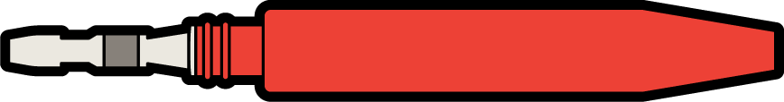
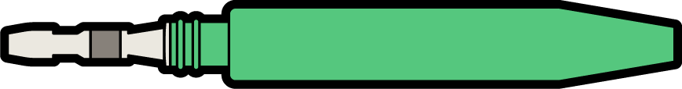
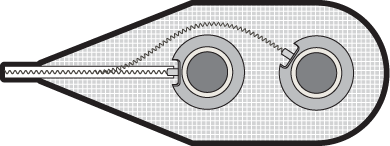

# Electrodes

Recording and stimulation electrodes

Quick Links: 

:link: **[Implantables-Electrodes on COSMIIC GitHub](https://github.com/COSMIIC-Inc/Implantables-Electrodes)**

---

## Component Overview

Electrical stimulation is delivered through metal electrodes placed near or in direct contact with neural tissue. Each electrode consists of the contact itself, a conducting lead, and a dual-contact connector to mate to the PG4 module. The intramuscular stimulating electrode is designed to be inserted into the belly of the target muscle. The epimysial stimulating electrode is designed to be sewn onto the surface of the target muscle. Despite the location of the electrode inside or on the muscle, electrical pulses delivered through the electrode cause activation of the nerves branching into the muscle, rather than direct activation of the muscle tissue itself.

---

## Technical Description of Electrode Types

The electrode cable is fabricated using wires of 316LVM stainless steel (0.034 mm diameter 
each), organized into a single seven-filament strand and coated with a perfluoroalkoxy 
polymer (PFA) to form an insulated, conducting filar. The cable is fabricated by winding 
two filars in tandem, forming a double helix of two conductors electrically insulated along 
their length. The coiled filars are placed inside medical-grade silicone tubing to form the 
cable. The cable outer diameter is approximately 1.3 mm. Since both electrode types used 
are monopolar - one tissue contact - the two filars are shorted to each other at the electrode 
and connector end, creating a single conductor with half the electrical resistance.

### Intramuscular Stimulating Electrodes

 

The intramuscular stimulating surface is 2mm long with an approximate surface area of 8 mm2. A 2-mm long polypropylene barbed anchor on the tip of the electrode maintains the position of the electrode in soft tissue. The electrode is inserted into the muscle using a probe and cannula system. 

### Epimysial Stimulating Electrodes

 

The epimysial stimulating electrode is a platinum-iridium disk with a brim supported by polyester mesh reinforced silicone rubber. The exposed metal contact is a disc 3.3 mm in diameter with a surface area of 8.55 mm2. The brim is sandwiched between two layers of silicone elastomer, leaving the conducting surface exposed through a hole in the top layer. The electrode is sewn onto the muscle epimysium using sutures through the polyester mesh backing. Five sutures are placed around the perimeter of the electrode backing, each tied with four knots, using 4-0 polyester suture.

---

## Documentation 

### Mechanical Design Files and Drawings
All files and drawings for the design of the Electrodes are available on the COSMIIC GitHub here:

:link: **[Implantables-Electrodes/"Mechanical Design CAD Files" on COSMIIC GitHub](https://github.com/COSMIIC-Inc/Implantables-Electrodes/tree/main/Mechanical%20Design%20CAD%20Files)**

### Design Controls and Verification of Electrode Designs
Specifications and testing for the Electrodes are documented on the COSMIIC GitHub here:

:link: **[Implantables-Verification/Electrodes on COSMIIC GitHub](https://github.com/COSMIIC-Inc/Implantables-Verification/tree/main/Electrodes)**

## Coming soon...

Information on the fabrication process, manufacturing partners, and how to obtain Electrodes will be uploaded soon.
