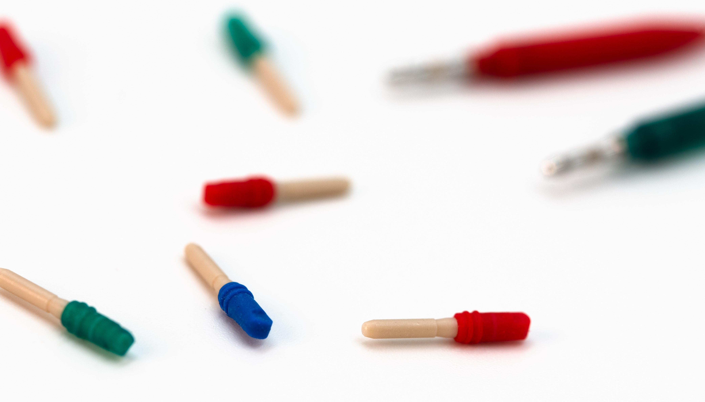

# Port Plugs

Protecting the port connections

---

## Component Overview

The Power Module header has two network ports and Remote Module headers have four network ports and four electrode cable ports. These header ports are closed with a port plug that is placed during manufacture. Port plugs are removed at the time of surgery to accommodate connection to the Power Module or Remote Module headers.

---

## Technical Overview

The port plug body consists of a PEEK rod cut to length and shaped to fit into the Bal-Seal connector springs. It is overmolded with a liquid silicone rubber strain relief with dual O­‐ring. The overmold serves as the handle for placing and removing from the header ports, and the dual O-ring keeps the port plug situated in place. The overmold and dual O-ring section is dyed with biocopmatible pigment to color code. This color code helps reinforce whether a module header port is oriented for network cables or electrode cables.

---

## Mechanical Design Files and Drawings

Drawing of the port plug is available on the COSMIIC GitHub here:

:link: **[Implantables-PM-Hardware/"Mechanical Design CAD Files"/"Drawing PDFs"/"NNP-DWG-115-001-000 Port Plug Assembly.pdf" on COSMIIC GitHub](https://github.com/COSMIIC-Inc/Implantables-PM-Hardware/blob/main/Mechanical%20Design%20CAD%20Files/Drawing%20PDFs/NNP-DWG-115-001-000%20Port%20Plug%20Assembly.pdf)**

Parts and assembly design files are available in .pdf, .STEP, ..SLDPRT, .SLDASM in the parent directory 

:link: **[Implantables-PM-Hardware/"Mechanical Design CAD Files" on COSMIIC GitHub](https://github.com/COSMIIC-Inc/Implantables-PM-Hardware/blob/main/Mechanical%20Design%20CAD%20Files)**